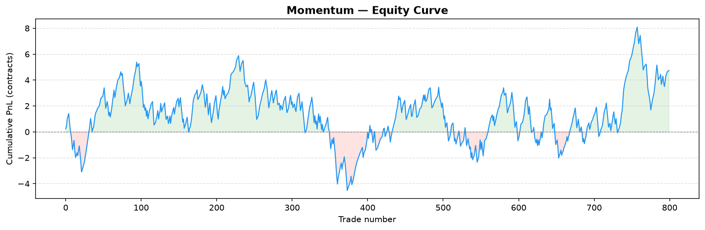
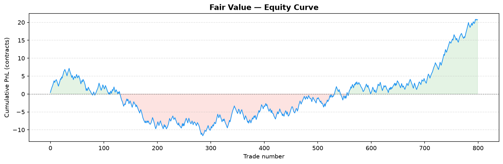

# Kalshi Paper Trading Bot

Paper trading bot for [Kalshi](https://kalshi.com) binary markets, focused on 15-minute BTC/ETH price contracts (KXBTC15M, KXETH15M).

Trades are **simulated** — no real orders are placed. All fills use live production market data.


## Strategies

Four independent hypotheses, each testing a different kind of market inefficiency.
The two hold-to-expiry strategies (Favorite-Longshot, Momentum) get a full
historical backtest with Wilson-CI significance testing; the two TP/SL,
path-dependent strategies (Mean-Reversion) get validated live via paper
trading instead — 1-min candlesticks can't reliably simulate an intra-candle
TP/SL fill, so pretending to backtest them would overstate confidence. Digital
option fair value is hold-to-expiry too, so it gets the full backtest
treatment despite being the most "model-heavy" of the four.

### FavoriteLongshotStrategy — behavioral bias
Exploits the favorite-longshot bias in prediction markets: contracts priced as
heavy favorites (YES ≥ 0.85) resolve as YES slightly less often than their
price implies. Buy NO, hold to expiry. Entry filters: YES mid ≥ 0.85,
time-to-expiry 5–13 min, spread ≤ 8 cents, no strong BTC/ETH momentum (via
Binance API). **Backtested** — see Key Findings below.

### MomentumStrategy — trend continuation
Deliberate mirror image of Mean-Reversion: bets a recent price move
*continues* into expiry rather than reverting. If the YES mid has moved by
more than a threshold over a trailing window, buy in the direction of the
move and hold to expiry. **Backtested** — see Key Findings below.

### FairValueStrategy — digital-option mispricing
Kalshi's KXBTC15M/KXETH15M contracts resolve YES if the reference price at
close is ≥ (or ≤) a strike fixed at market open — i.e. they're literally
cash-or-nothing digital options on "does the price finish above its own
opening level." `kalshi/utils/pricing.py` prices that in closed form (a
zero-drift lognormal model: spot + realized volatility from Binance, strike
+ time-to-expiry from Kalshi) and trades whichever side disagrees with
Kalshi's own quote by more than the round-trip cost. **Backtested** — see Key
Findings below.

### MeanReversionStrategy — reversal (documented negative result)
Buy YES after a down-move showing signs of recovery, NO after an up-move
showing signs of decline. TP/SL-based, so it's **live-only**: in production
paper trading the asymmetric TP/SL parameters (1.5c profit vs 2.5c loss)
produced near-zero edge after fees. Kept as an example of hypothesis-driven
design that didn't pan out, not deleted.

Risk controls in the live engine (`kalshi/live/engine.py`), shared by all four
strategies: a daily-loss circuit breaker (default 20% of starting cash halts
new entries) and a per-ticker re-entry cooldown after each exit.

## Architecture

```
kalshi/
  client.py            Kalshi API client — RSA-PSS signed requests
  data/live.py          Live market data fetcher (public API, no auth)
  data/binance_history.py  Historical Binance klines (fair-value backtest)
  db/ingest.py           SQLite ingestion of paper-trading run results
  strategies/            Strategy implementations (Strategy ABC + Signal)
  backtest/              Historical backtest engines, metrics, charts
    engine.py, metrics.py, charts.py           Favorite-Longshot (NO-only)
    fair_value_engine.py                       Fair-value mispricing
    momentum_engine.py                         Momentum
    common_metrics.py, common_charts.py        Shared side-aware stats/charts
  live/engine.py         Paper trading engine (the live loop, all strategies)
  utils/                 Shared time/fee/market-data/pricing helpers
```

`kalshi/backtest/metrics.py` stays NO-side-only (Favorite-Longshot always
trades NO); `common_metrics.py` is a separate, additive module for strategies
that can trade either side — a deliberate "don't abstract prematurely" call
instead of refactoring the original, already-tested pipeline.

Root-level scripts are thin CLI entry points over the package:

| File | Purpose |
|------|---------|
| `runner.py` | Main paper-trading loop — start runs here (`--strategy` selects among all four) |
| `backtest.py` | Favorite-Longshot backtest CLI |
| `backtest_momentum.py` | Momentum backtest CLI |
| `backtest_fair_value.py` | Fair-value backtest CLI |
| `db_ingest.py` | Ingest run results into local SQLite database |
| `market_analysis.py` | Standalone live market sampling tool (spreads, volatility) |
| `run_daily.bat` | Windows scheduled task script (runs daily at 15:30) |

## Setup

```bash
python -m venv venv
venv\Scripts\activate
pip install -r requirements.txt
```

Copy `.env.example` to `.env` and fill in your Kalshi API credentials.

## Running

```bash
# Paper trading run (2h, US open window only)
python runner.py --strategy favorite_longshot --duration-minutes 120 --trading-window 13:30-15:30

# Backtest the favorite-longshot bias on historical data
python backtest.py --max-markets 500 --plot results/chart

# Backtest momentum / fair-value on historical data
python backtest_momentum.py --max-markets 500 --plot results/momentum
python backtest_fair_value.py --max-markets 500 --plot results/fair_value

# Analyse paper-trading results
python db_ingest.py --all
```

## Testing

```bash
pytest -q
```

88 tests covering fee calculation, time utilities, digital-option pricing,
strategy signal logic (all four strategies), and each backtest engine's
no-lookahead guarantee.

## Configuration (`.env`)

```
KALSHI_BASE_URL=https://api.elections.kalshi.com
KALSHI_API_KEY_ID=your-key-id
KALSHI_KEY_FILE=path/to/your.key
```

## Key Findings

### Favorite-Longshot
Production backtest (N=2033, Feb–Mar 2026):
- **Overall NO win rate: 10.3%** — no general favorite-longshot bias on Kalshi
- **us_open_burst (13:30–15:30 UTC): 15.7% WR, z=+2.51** — only window with positive edge
- All other time windows: neutral or negative EV

Live validation ongoing (N=13 us_open_burst trades as of May 2026).

### Momentum
Production backtest (N=800, both series, threshold=2% over a 5-min trailing window):
- **Overall: 70.0% win rate, EV/contract −0.009, z=+0.36** — no significant edge
- **side=no (betting a down-move continues): 75.8% WR, EV/contract +0.033, z=+2.14** — borderline significant
- **side=yes (betting an up-move continues): 63.4% WR, EV/contract −0.056, z=−1.69** — mildly negative

The entry threshold turned out to be non-binding — a >=2% move in the trailing
window occurs in essentially every market sampled (800/800 signaled), so this
reads more like "unconditional direction persistence" than a rare, selective
signal. Worth tightening the threshold before trusting it further.



### Fair Value
Production backtest (N=800, both series, min_edge=3 percentage points, 60-min realized-vol window):
- **Overall: 48.9% win rate, EV/contract +0.009, z=+1.47** — not significant
- **side=no (model says Kalshi overprices YES): 70.0% WR, EV/contract +0.205, z=+4.88** — highly significant
- **side=yes (model says Kalshi underprices YES): 45.1% WR, EV/contract −0.026, z=−0.46** — no edge

Like the threshold above, min_edge=3pp didn't filter much (800/800 signaled).
The side=no result is the most statistically striking finding across all four
strategies here — whether it holds up needs a held-out test split and more
data before it's trustworthy, not just a bigger green number on a chart.


