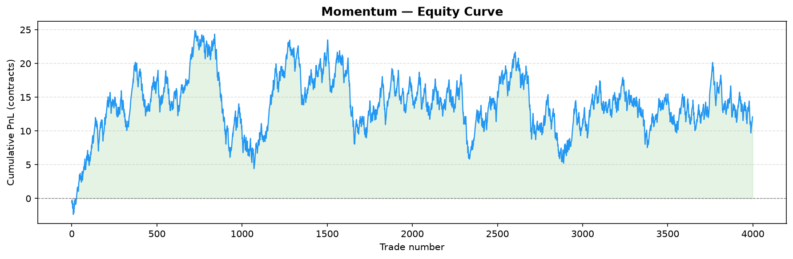
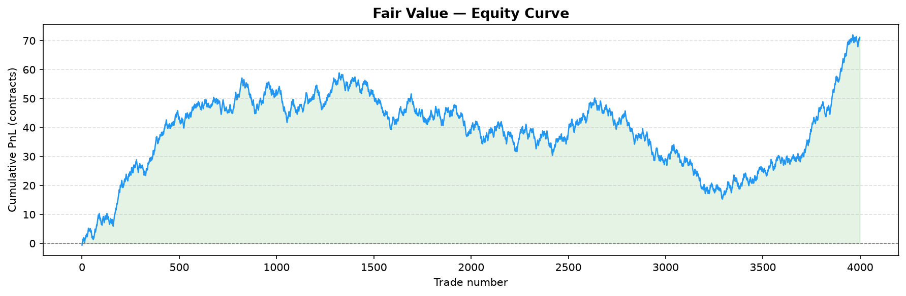

# Kalshi Paper Trading Bot

Paper trading bot for [Kalshi](https://kalshi.com) binary markets, focused on 15-minute BTC/ETH price contracts (KXBTC15M, KXETH15M).

Trades are **simulated** — no real orders are placed. All fills use live production market data.


**[analysis.ipynb](analysis.ipynb)** — per-strategy summary, month-by-month
comparison, and out-of-sample validation, all in one place with tables and
charts. Renders fully on GitHub, no setup needed.

## Strategies

Four independent hypotheses, each testing a different kind of market inefficiency.
The two hold-to-expiry strategies (Favorite-Longshot, Momentum) get a full
historical backtest with Wilson-CI significance testing; the two TP/SL,
path-dependent strategies (Mean-Reversion) get validated live via paper
trading instead — 1-min candlesticks can't reliably simulate an intra-candle
TP/SL fill, so pretending to backtest them would overstate confidence. Digital
option fair value is hold-to-expiry too, so it gets the full backtest
treatment despite being the most "model-heavy" of the four.

### FavoriteLongshotStrategy — behavioral bias
Exploits the favorite-longshot bias in prediction markets: contracts priced as
heavy favorites (YES ≥ 0.85) resolve as YES slightly less often than their
price implies. Buy NO, hold to expiry. Entry filters: YES mid ≥ 0.85,
time-to-expiry 5–13 min, spread ≤ 8 cents, no strong BTC/ETH momentum (via
Binance API). **Backtested** — see Key Findings below.

### MomentumStrategy — trend continuation
Deliberate mirror image of Mean-Reversion: bets a recent price move
*continues* into expiry rather than reverting. If the YES mid has moved by
more than a threshold over a trailing window, buy in the direction of the
move and hold to expiry. **Backtested** — see Key Findings below.

### FairValueStrategy — digital-option mispricing
Kalshi's KXBTC15M/KXETH15M contracts resolve YES if the reference price at
close is ≥ (or ≤) a strike fixed at market open — i.e. they're literally
cash-or-nothing digital options on "does the price finish above its own
opening level." `kalshi/utils/pricing.py` prices that in closed form (a
zero-drift lognormal model: spot + realized volatility from Binance, strike
+ time-to-expiry from Kalshi) and trades whichever side disagrees with
Kalshi's own quote by more than the round-trip cost. **Backtested** — see Key
Findings below.

### MeanReversionStrategy — reversal (documented negative result)
Buy YES after a down-move showing signs of recovery, NO after an up-move
showing signs of decline. TP/SL-based, so it's **live-only**: in production
paper trading the asymmetric TP/SL parameters (1.5c profit vs 2.5c loss)
produced near-zero edge after fees. Kept as an example of hypothesis-driven
design that didn't pan out, not deleted.

Risk controls in the live engine (`kalshi/live/engine.py`), shared by all four
strategies: a daily-loss circuit breaker (default 20% of starting cash halts
new entries) and a per-ticker re-entry cooldown after each exit.

## Architecture

```
kalshi/
  client.py            Kalshi API client — RSA-PSS signed requests
  data/live.py          Live market data fetcher (public API, no auth)
  data/binance_history.py  Historical Binance klines (fair-value backtest)
  db/ingest.py           SQLite ingestion of paper-trading run results
  strategies/            Strategy implementations (Strategy ABC + Signal)
  backtest/              Historical backtest engines, metrics, charts
    engine.py, metrics.py, charts.py           Favorite-Longshot (NO-only)
    fair_value_engine.py                       Fair-value mispricing
    momentum_engine.py                         Momentum
    common_metrics.py, common_charts.py        Shared side-aware stats/charts
  live/engine.py         Paper trading engine (the live loop, all strategies)
  utils/                 Shared time/fee/market-data/pricing helpers
```

Both `metrics.py` and `common_metrics.py` also compute a Sharpe ratio
(`sharpe_ratio()`) — per-trade mean/stdev of net PnL after fees, plus an
*observed-frequency* annualized version. That annualization is explicitly not
a standard daily-return Sharpe: these are event-driven signals with irregular
spacing, so blindly multiplying by sqrt(252) would overstate confidence the
same way backtesting TP/SL off 1-min candles would (see MeanReversion above).

`kalshi/backtest/metrics.py` stays NO-side-only (Favorite-Longshot always
trades NO); `common_metrics.py` is a separate, additive module for strategies
that can trade either side — a deliberate "don't abstract prematurely" call
instead of refactoring the original, already-tested pipeline.

Root-level scripts are thin CLI entry points over the package:

| File | Purpose |
|------|---------|
| `runner.py` | Main paper-trading loop — start runs here (`--strategy` selects among all four) |
| `backtest.py` | Favorite-Longshot backtest CLI |
| `backtest_momentum.py` | Momentum backtest CLI |
| `backtest_fair_value.py` | Fair-value backtest CLI |
| `compare_periods.py` | Runs all 3 backtestable strategies across calendar months, writes `results/period_comparison.csv` |
| `db_ingest.py` | Ingest run results into local SQLite database |
| `market_analysis.py` | Standalone live market sampling tool (spreads, volatility) |
| `run_daily.bat` | Windows scheduled task script (runs daily at 15:30) |
| `analysis.ipynb` | Notebook tying the above together — see link above |

## Setup

```bash
python -m venv venv
venv\Scripts\activate
pip install -r requirements.txt
```

Copy `.env.example` to `.env` and fill in your Kalshi API credentials.

## Running

```bash
# Paper trading run (2h, US open window only)
python runner.py --strategy favorite_longshot --duration-minutes 120 --trading-window 13:30-15:30

# Backtest the favorite-longshot bias on historical data
python backtest.py --max-markets 500 --plot results/chart

# Backtest momentum / fair-value on historical data
python backtest_momentum.py --max-markets 500 --plot results/momentum
python backtest_fair_value.py --max-markets 500 --plot results/fair_value

# Train/test split (out-of-sample check) on a calendar window
python backtest_fair_value.py --from 2026-04-15 --to 2026-06-06 --test-after 2026-05-24

# Compare all 3 backtestable strategies across calendar months
python compare_periods.py

# Analyse paper-trading results
python db_ingest.py --all
```

`analysis.ipynb` (needs `jupyter`/`ipykernel`, not in `requirements.txt` since
it's only needed to *re-run* the notebook, not to view it on GitHub):

```bash
pip install jupyter ipykernel
jupyter notebook analysis.ipynb
```

## Testing

```bash
pytest -q
```

95 tests covering fee calculation, time utilities, digital-option pricing,
Sharpe-ratio calculation, strategy signal logic (all four strategies), and
each backtest engine's no-lookahead guarantee.

## Configuration (`.env`)

```
KALSHI_BASE_URL=https://api.elections.kalshi.com
KALSHI_API_KEY_ID=your-key-id
KALSHI_KEY_FILE=path/to/your.key
```

## Key Findings

### Favorite-Longshot
Production backtest (N=2033, Feb–Mar 2026):
- **Overall NO win rate: 10.3%** — no general favorite-longshot bias on Kalshi
- **us_open_burst (13:30–15:30 UTC): 15.7% WR, z=+2.51** — only window with positive edge
- All other time windows: neutral or negative EV

Live validation ongoing (N=13 us_open_burst trades as of May 2026).

### Momentum
Initial production backtest (N=800, both series, threshold=2% over a 5-min
trailing window) split roughly evenly by side: **overall 70.0% win rate,
EV/contract −0.009, z=+0.36 — no significant edge**, but
**side=no (betting a down-move continues): 75.8% WR, EV/contract +0.033,
z=+2.14 — borderline significant**, while side=yes ran mildly negative
(63.4% WR, EV/contract −0.056, z=−1.69).

**Out-of-sample check** (`--from 2026-05-10 --to 2026-06-06 --test-after
2026-05-24`, N=3999, ~4-week train / ~2-week test split) confirms the
side asymmetry and, if anything, strengthens the side=no signal on the held-out
period:

| Split | N (side=no) | WR | EV/contract | z |
|---|---|---|---|---|
| Train | 674  | 66.5% | −0.005 | +0.60 |
| Test  | 1326 | 71.6% | +0.014 | +2.24 |

side=yes reverses to a significantly *negative* z=−2.36 on the test split —
so "buy NO after a down-move continues" looks like the real (if modest) part
of this signal, "buy YES after an up-move continues" does not.
Sharpe (per-trade, combined): +0.003 — essentially flat; the *annualized*
figure this implies is enormous (~69,000 trades/year observed frequency) and
not meaningful here, see the Sharpe caveat above.

The entry threshold itself is still non-binding — a ≥2% move in the trailing
window occurs in essentially every market sampled — so this reads more like
"conditional direction persistence on the downside" than a rare, selective
signal. Tightening the threshold is the natural next step.



### Fair Value
Initial production backtest (N=800) found a striking but small (N=120)
side=no result and was explicitly flagged as needing a held-out test before
trusting it. That check has now been run.

**Out-of-sample check** (same window as Momentum above, N=3999) — the finding
holds up and is essentially unchanged in effect size between train and test:

| Split | N (side=no) | WR | EV/contract | z |
|---|---|---|---|---|
| Train | 89  | 73.0% | +0.231 | +4.70 |
| Test  | 195 | 71.3% | +0.221 | +6.66 |
| **Combined** | **284** | **71.8%** | **+0.224** | **+8.15** |

side=yes stays at no edge in both splits (combined z=+0.08). The effect is
concentrated in a small fraction of markets — 284 of 3999 signaled on the NO
side, the rest on YES, which has no edge — so this isn't the model firing
constantly and getting lucky on average; it's a specific, repeatable
disagreement between the model and Kalshi's quote. This is the standout
result of the whole project: a real, out-of-sample-replicated statistical
edge specifically when the digital-option model says Kalshi overprices
YES — not proof of a robust tradeable strategy yet (still one ~6-week
window, one regime), but a properly validated one rather than an exciting
single backtest number.



### Period comparison
`compare_periods.py` runs all three backtestable strategies across calendar
months (Feb–May 2026); see `results/period_comparison.csv` and
`analysis.ipynb` for the full table and chart. **Caveat:** each month is
capped at 150 markets/series for runtime, and the engines sample the most
*recent* qualifying markets in a date range — so each "month" here is really
its last ~1.5 days, not a full-month average. Directionally still useful:
Fair Value's overall (both-sides) EV per contract was positive and
significant in Feb–Apr (z up to +4.72) and went negative in May (z=−0.92) —
consistent with the side=no-only edge being real but diluted by the larger,
no-edge side=yes population in any given snapshot, not evidence against the
side=no finding itself.
