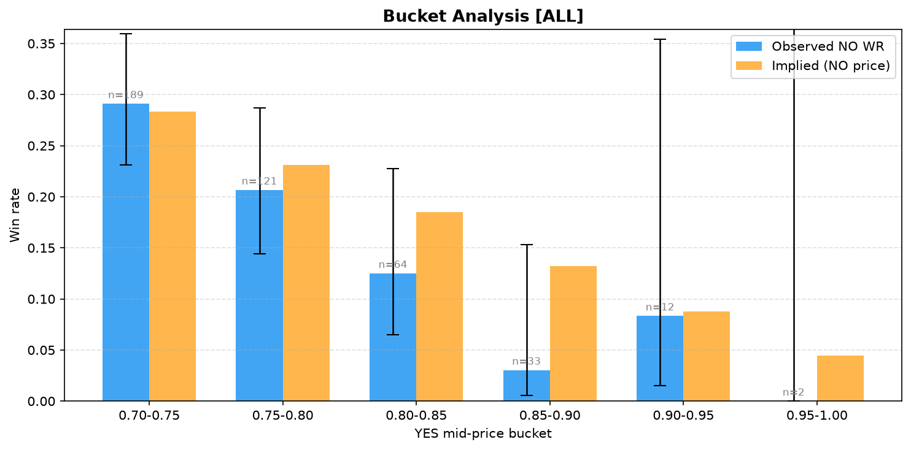
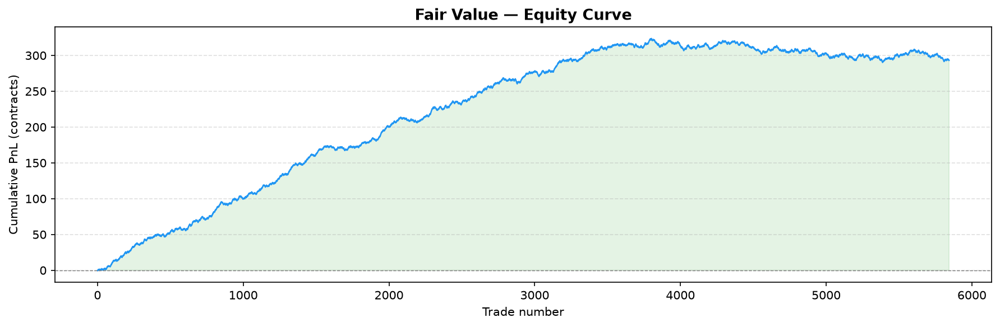
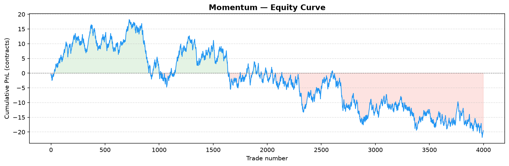

# Kalshi Paper Trading Bot

Paper trading bot for [Kalshi](https://kalshi.com) binary markets, focused on 15-minute BTC/ETH price contracts (KXBTC15M, KXETH15M).

Trades are **simulated** — no real orders are placed. All fills use live production market data.



**[analysis.ipynb](analysis.ipynb)** — per-strategy summary, month-by-month
comparison, and out-of-sample validation, all in one place with tables and
charts. Renders fully on GitHub, no setup needed.

## Strategies

Four independent hypotheses, each testing a different kind of market inefficiency.
The two hold-to-expiry strategies (Favorite-Longshot, Momentum) get a full
historical backtest with Wilson-CI significance testing; the two TP/SL,
path-dependent strategies (Mean-Reversion) get validated live via paper
trading instead — 1-min candlesticks can't reliably simulate an intra-candle
TP/SL fill, so pretending to backtest them would overstate confidence. Digital
option fair value is hold-to-expiry too, so it gets the full backtest
treatment despite being the most "model-heavy" of the four.

### FavoriteLongshotStrategy — behavioral bias
Exploits the favorite-longshot bias in prediction markets: contracts priced as
heavy favorites (YES ≥ 0.85) resolve as YES slightly less often than their
price implies. Buy NO, hold to expiry. Entry filters: YES mid ≥ 0.85,
time-to-expiry 5–13 min, spread ≤ 8 cents, no strong BTC/ETH momentum (via
Binance API). **Backtested** — see Key Findings below.

### MomentumStrategy — trend continuation (documented negative result)
Deliberate mirror image of Mean-Reversion: bets a recent price move
*continues* into expiry rather than reverting. If the YES mid has moved by
more than a threshold over a trailing window, buy in the direction of the
move and hold to expiry. **Backtested and out-of-sample tested — the
apparent edge turned out to be a fill-price modeling artifact and
disappears under a corrected, executable-price fill model.** See Key
Findings below; kept as another example (alongside MeanReversion) of a
hypothesis that didn't survive scrutiny.

### FairValueStrategy — digital-option mispricing
Kalshi's KXBTC15M/KXETH15M contracts resolve YES if the reference price at
close is ≥ (or ≤) a strike fixed at market open — i.e. they're literally
cash-or-nothing digital options on "does the price finish above its own
opening level." `kalshi/utils/pricing.py` prices that in closed form (a
zero-drift lognormal model: spot + realized volatility from Binance, strike
+ time-to-expiry from Kalshi) and trades whichever side disagrees with
Kalshi's own quote by more than the round-trip cost. **Backtested,
out-of-sample tested, and re-confirmed on a full uncapped month of
data — the strongest, most validated result in this project.** See Key
Findings below.

### MeanReversionStrategy — reversal (documented negative result)
Buy YES after a down-move showing signs of recovery, NO after an up-move
showing signs of decline. TP/SL-based, so it's **live-only**: in production
paper trading the asymmetric TP/SL parameters (1.5c profit vs 2.5c loss)
produced near-zero edge after fees. Kept as an example of hypothesis-driven
design that didn't pan out, not deleted.

Risk controls in the live engine (`kalshi/live/engine.py`), shared by all four
strategies: a daily-loss circuit breaker (default 20% of starting cash halts
new entries) and a per-ticker re-entry cooldown after each exit.

## Architecture

```
kalshi/
  client.py            Kalshi API client — RSA-PSS signed requests
  data/live.py          Live market data fetcher (public API, no auth)
  data/binance_history.py  Historical Binance klines (fair-value backtest)
  db/ingest.py           SQLite ingestion of paper-trading run results
  strategies/            Strategy implementations (Strategy ABC + Signal)
  backtest/              Historical backtest engines, metrics, charts
    engine.py, metrics.py, charts.py           Favorite-Longshot (NO-only)
    fair_value_engine.py                       Fair-value mispricing
    momentum_engine.py                         Momentum
    common_metrics.py, common_charts.py        Shared side-aware stats/charts
  live/engine.py         Paper trading engine (the live loop, all strategies)
  utils/                 Shared time/fee/market-data/pricing helpers
```

Both `metrics.py` and `common_metrics.py` also compute a Sharpe ratio
(`sharpe_ratio()`) — per-trade mean/stdev of net PnL after fees, plus an
*observed-frequency* annualized version. That annualization is explicitly not
a standard daily-return Sharpe: these are event-driven signals with irregular
spacing, so blindly multiplying by sqrt(252) would overstate confidence the
same way backtesting TP/SL off 1-min candles would (see MeanReversion above).

**Fill model:** all three backtest engines price the recorded economic
outcome (what feeds win-rate/EV/Sharpe) at the *executable* quote —
`yes_ask` for a YES entry, `1 - yes_bid` for a NO entry — never the midpoint,
which was Kalshi's own quoted bid/ask average and was never actually
fillable. `kalshi/utils/market.py`'s `parse_quote()` returns bid, ask, and
mid together; entry-filter/threshold decisions (e.g. Longshot's `mid >=
0.85`) still use mid, since those characterize market consensus rather than
what you'd pay, but every dollar figure that feeds a statistic uses the real
price. `kalshi/utils/fees.py` also rounds the taker fee up to the cent on
the whole order (`ceil(0.07 * price * (1-price) * qty * 100) / 100`),
matching Kalshi's actual rounding rather than leaving it unrounded. See
**Key Findings → Fill Model Fix** below for why this mattered and how much.

`kalshi/backtest/metrics.py` stays NO-side-only (Favorite-Longshot always
trades NO); `common_metrics.py` is a separate, additive module for strategies
that can trade either side — a deliberate "don't abstract prematurely" call
instead of refactoring the original, already-tested pipeline.

Root-level scripts are thin CLI entry points over the package:

| File | Purpose |
|------|---------|
| `runner.py` | Main paper-trading loop — start runs here (`--strategy` selects among all four) |
| `backtest.py` | Favorite-Longshot backtest CLI |
| `backtest_momentum.py` | Momentum backtest CLI |
| `backtest_fair_value.py` | Fair-value backtest CLI |
| `compare_periods.py` | Runs all 3 backtestable strategies across calendar months, writes `results/period_comparison.csv` |
| `db_ingest.py` | Ingest run results into local SQLite database |
| `market_analysis.py` | Standalone live market sampling tool (spreads, volatility) |
| `run_daily.bat` | Windows scheduled task script (runs daily at 15:30) |
| `analysis.ipynb` | Notebook tying the above together — see link above |

## Setup

```bash
python -m venv venv
venv\Scripts\activate
pip install -r requirements.txt
```

Copy `.env.example` to `.env` and fill in your Kalshi API credentials.

## Running

```bash
# Paper trading run (2h, US open window only)
python runner.py --strategy favorite_longshot --duration-minutes 120 --trading-window 13:30-15:30

# Backtest the favorite-longshot bias on historical data
python backtest.py --max-markets 500 --plot results/chart

# Backtest momentum / fair-value on historical data
python backtest_momentum.py --max-markets 500 --plot results/momentum
python backtest_fair_value.py --max-markets 500 --plot results/fair_value

# Train/test split (out-of-sample check) on a calendar window
python backtest_fair_value.py --from 2026-04-15 --to 2026-06-06 --test-after 2026-05-24

# Compare all 3 backtestable strategies across calendar months
python compare_periods.py

# Analyse paper-trading results
python db_ingest.py --all
```

`analysis.ipynb` (needs `jupyter`/`ipykernel`, not in `requirements.txt` since
it's only needed to *re-run* the notebook, not to view it on GitHub):

```bash
pip install jupyter ipykernel
jupyter notebook analysis.ipynb
```

## Testing

```bash
pytest -q
```

101 tests covering fee calculation (including cent rounding), time
utilities, digital-option pricing, Sharpe-ratio calculation, strategy signal
logic (all four strategies), and each backtest engine's no-lookahead
guarantee and executable-price fill model.

## Configuration (`.env`)

```
KALSHI_BASE_URL=https://api.elections.kalshi.com
KALSHI_API_KEY_ID=your-key-id
KALSHI_KEY_FILE=path/to/your.key
```

## Key Findings

### Fill Model Fix (read this first)

All three backtest engines originally priced trades at the **midpoint** of
Kalshi's quoted bid/ask — never actually fillable; buying YES costs the ask,
buying NO costs `1 - yes_bid`. That inflates apparent edge by roughly half
the spread on every single trade. Caught by cross-checking this project's
own results against Kalshi's real order-book mechanics rather than trusting
the code's own assumptions (spreads on these markets are actually fairly
tight — median 1¢, 90th percentile 3–4¢ — so the damage was real but not
catastrophic). Fixed across all three engines, plus the fee calculation now
rounds up to the cent the way Kalshi actually charges it (previously
unrounded). Full re-validation, before vs. after:

| Strategy | Metric | Before (mid-price) | After (executable price) |
|---|---|---|---|
| Momentum side=no | N=800 base run | WR 75.8%, z=+2.14 | WR 65.7%, z=−0.31 |
| Momentum side=no | Out-of-sample (N=2000) | z=+2.16 | z=+1.43, EV/c ≈ 0 |
| Fair Value side=no | N=800 base run | N=120, WR 70.0%, z=+4.88 | N=31, WR 74.2%, z=+2.26 |
| Fair Value side=no | Out-of-sample (N≈4000) | N=284, EV/c +0.224, z=+8.15 | N=233, EV/c +0.221, z=+7.30 |

**Momentum's edge was a mid-price artifact** — it collapses to essentially
zero once real fill prices are used, in both the base run and out-of-sample.
**Fair Value's edge survives** — effect size (EV/contract) is nearly
unchanged, it's just measured on a smaller, more honestly-filtered sample
(the fee-adjusted edge threshold now correctly excludes trades that only
looked profitable because of the mid-price shortcut). This is exactly the
outcome this check was for: one finding got debunked, the other got
independently strengthened by surviving a test that could have killed it.

### Fair Value — the strongest result

Full calendar month, uncapped (`--from 2026-05-01 --to 2026-05-31
--max-markets 5000`; 2,921–2,923 markets per series, no cap hit, confirmed
covering the entire month, not a truncated tail):

- **side=no: N=1,029, win rate 65.1%, EV/contract +0.136, z=+9.85**
- side=yes: N=4,815, EV/contract +0.011, z=+3.89 — a much smaller, less
  reliable edge, consistent with side=no being where the real signal lives
- Overall (both sides): z=+7.67

This is now backed by three independent samples at increasing scale, all
pointing the same direction: an initial 4-day sample (N=120 → N=31 corrected),
a 6-week out-of-sample train/test split (N=284 → N=233 corrected, train
z=+3.91 / test z=+6.17 independently), and this full-month run (N=1,029,
z=+9.85). Effect size (EV/contract) is stable in the +0.14 to +0.22 range
across all of them — the exact number moves with sample composition, but the
direction and rough magnitude don't. Still one calendar month, one regime —
not a claim this persists forever, but no longer a single exciting backtest
number either.



### Momentum — debunked, kept as a documented negative result

Same treatment as MeanReversion: a hypothesis that looked promising,
survived one pass, and failed the follow-up check. Corrected out-of-sample
(N=3999): overall z=−0.66, side=no z=+1.43 (not significant), EV/contract
essentially zero (−0.0002). The entry threshold was also never
selective — a ≥2% move in the trailing window fires on nearly every market
sampled — so even the pre-fix "signal" was closer to unconditional market
behavior than a rare, tradeable pattern.



### Favorite-Longshot
Original production backtest (N=2033, Feb–Mar 2026, predates this session's
fill-model fix): overall NO win rate 10.3% (no general bias), us_open_burst
window (13:30–15:30 UTC) 15.7% WR, z=+2.51 — the only window with positive
edge. A fresh sample with the corrected engine (N=421, late June 2026, not
the same window so not a direct before/after) shows the same shape — no
across-the-board edge, bucket-level EV mostly negative or flat — consistent
with, though not a literal re-run of, the original finding. Re-validating
the exact Feb–Mar window with the corrected engine is a natural next step,
lower priority than Fair Value since Longshot's effect was already
concentrated in one narrow window rather than a broad claim.

### Period comparison (stale — predates the fill-model fix)
`compare_periods.py` / `results/period_comparison.csv` were generated before
the mid-price fix above and should be treated as superseded — regenerating
them is a follow-up, not done in this round. Separately, that script also
has a real sampling bug: each "month" is capped at 150 markets/series and
the engines take the most *recent* qualifying markets in a date range, so
each "month" is actually only its last ~1.5 days, not a representative
average. Both issues affect the same file — don't cite numbers from it
without fixing both first.
