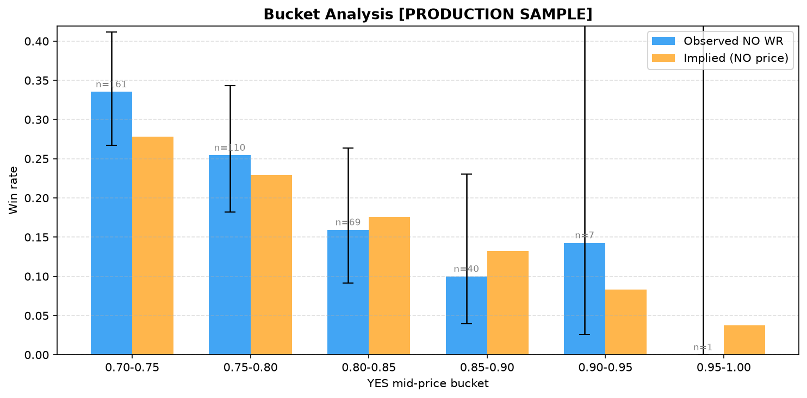

# Kalshi Paper Trading Bot

Paper trading bot for [Kalshi](https://kalshi.com) binary markets, focused on 15-minute BTC/ETH price contracts (KXBTC15M, KXETH15M).

Trades are **simulated** — no real orders are placed. All fills use live production market data.



## Strategy

**FavoriteLongshotStrategy** — exploits the favorite-longshot bias in prediction markets: contracts priced as heavy favorites (YES ≥ 0.85) resolve as YES slightly less often than their price implies.

Entry filters:
- YES mid ≥ 0.85
- Time-to-expiry: 5–13 min
- Spread ≤ 8 cents
- No strong BTC/ETH momentum (via Binance API)

Position: buy NO, hold to expiry (no stop-loss, time-stop at 14 min).

Risk controls in the live engine (`kalshi/live/engine.py`): a daily-loss circuit
breaker (default 20% of starting cash halts new entries) and a per-ticker
re-entry cooldown after each exit.

## Architecture

```
kalshi/
  client.py          Kalshi API client — RSA-PSS signed requests
  data/live.py        Live market data fetcher (public API, no auth)
  db/ingest.py         SQLite ingestion of paper-trading run results
  strategies/          Strategy implementations (Strategy ABC + Signal)
  backtest/            Historical backtest engine, metrics, charts
  live/engine.py       Paper trading engine (the live loop)
  utils/               Shared time/fee/market-data helpers
```

Root-level scripts are thin CLI entry points over the package:

| File | Purpose |
|------|---------|
| `runner.py` | Main paper-trading loop — start runs here |
| `backtest.py` | Backtest CLI — scans historical markets, exports CSV + charts |
| `db_ingest.py` | Ingest run results into local SQLite database |
| `market_analysis.py` | Standalone live market sampling tool (spreads, volatility) |
| `run_daily.bat` | Windows scheduled task script (runs daily at 15:30) |

## Setup

```bash
python -m venv venv
venv\Scripts\activate
pip install -r requirements.txt
```

Copy `.env.example` to `.env` and fill in your Kalshi API credentials.

## Running

```bash
# Paper trading run (2h, US open window only)
python runner.py --strategy favorite_longshot --duration-minutes 120 --trading-window 13:30-15:30

# Backtest the favorite-longshot bias on historical data
python backtest.py --max-markets 500 --plot results/chart

# Analyse paper-trading results
python db_ingest.py --all
```

## Testing

```bash
pytest -q
```

46 tests covering fee calculation, time utilities, strategy signal logic, and
the backtest engine's no-lookahead guarantee.

## Configuration (`.env`)

```
KALSHI_BASE_URL=https://api.elections.kalshi.com
KALSHI_API_KEY_ID=your-key-id
KALSHI_KEY_FILE=path/to/your.key
```

## Key Findings

Production backtest (N=2033, Feb–Mar 2026):
- **Overall NO win rate: 10.3%** — no general favorite-longshot bias on Kalshi
- **us_open_burst (13:30–15:30 UTC): 15.7% WR, z=+2.51** — only window with positive edge
- All other time windows: neutral or negative EV

Live validation ongoing (N=13 us_open_burst trades as of May 2026).
